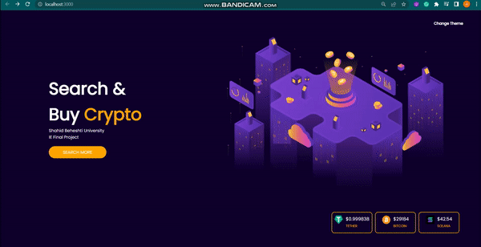

# Why?

    <b>Internet Engineering Course MidTerm Project(Spring 2022)

# Use : 
- HTML 
- CSS
- ReactJS

# Data :

[CryptoCurrencies API](https://www.coingecko.com/en/api/documentation ) 

# Find Out How To  :

- Change Theme
-  Use Local Storage

# How To Install?
- `npm install`

# How To Run?
- `npm start`

# Final Result 

  

